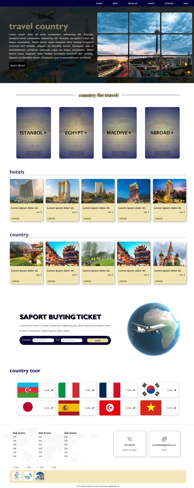

# Air Travel Agency

### [🔗 Live Demo](https://eli-khodayi-dev.github.io/Air-Travel-Agency/)

## Project Description

This project is a travel agency landing page designed to present travel destinations, hotels, ticket support, and country tours in a visually appealing way.

The website was built using **HTML**, **CSS3**, and **CSS animations**. It features a modern dark-blue and gold color palette, smooth hover effects, and a grid-based layout for showcasing travel images. One of the main highlights of the design is the image grid in the hero section, where the photo tiles connect together on hover to create a more interactive visual effect.

### Features
- Stylish hero section with navigation and a large travel introduction area
- Interactive image grid with hover animation
- Destination cards for popular countries
- Hotel and country showcase sections
- Ticket support form with input fields and submit button
- Country tour section with flag cards
- Footer with links, contact information, and trust badges

### Technologies Used
- HTML5
- CSS3
- CSS Grid
- CSS Animations
- Responsive Layout Design
